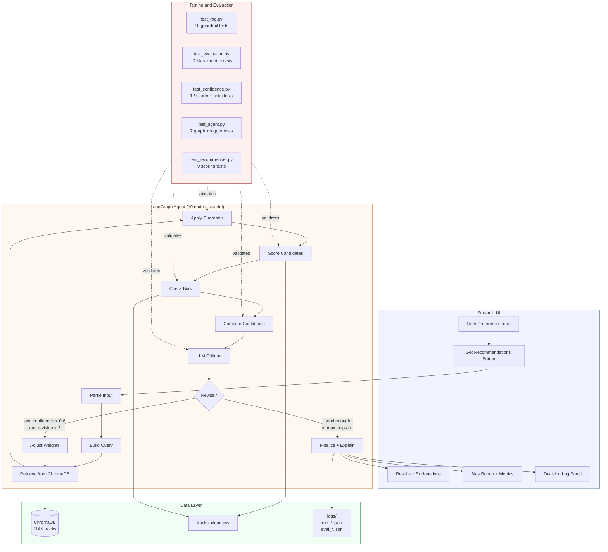

# System Architecture Diagram

## Data Flow

1. User enters preferences in Streamlit (genres, mood, energy, danceability, tempo, acousticness, free text)
2. LangGraph agent parses input and builds a natural language query
3. ChromaDB returns 30 candidate tracks via semantic similarity search
4. Guardrails filter out low-relevance, over-represented genre, repeated artist, and incomplete tracks
5. Remaining candidates are ranked by cosine similarity against the user's preference vector
6. Bias detector compares recommendation distribution against a 1000-track catalog sample
7. Confidence scorer assigns each track a 0-to-1 score from four weighted signals
8. LLM (or rule-based fallback) critiques the list and decides whether to revise
9. If confidence is low and revisions remain, the agent adjusts weights and loops back to step 3
10. Final list gets per-song explanations and is returned to the UI with the full decision log

## Where Humans and Tests Fit In

The user reviews recommendations, explanations, bias flags, and the decision log in the Streamlit UI. Every guardrail, bias check, scoring function, critique rule, and graph conditional is covered by automated tests (50 total). Run logs and evaluation reports are persisted as JSON for offline review.
